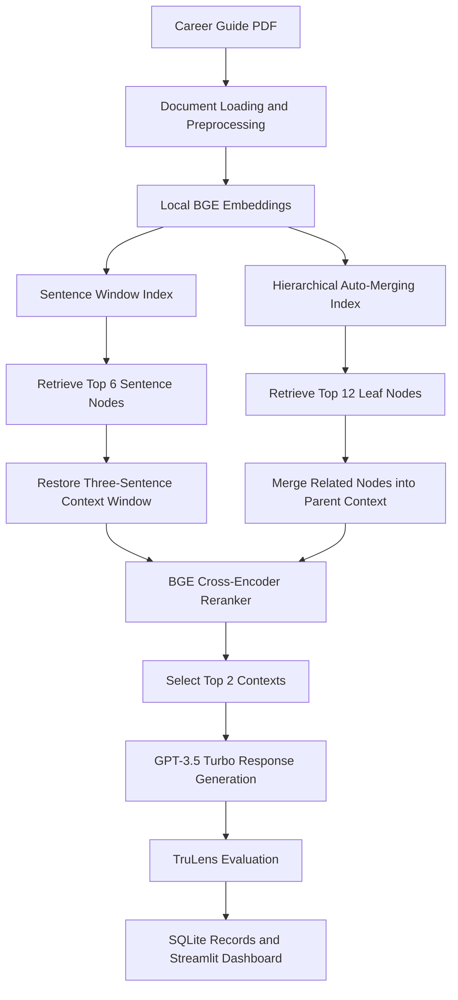

# Advanced RAG Pipeline: Retrieval Optimization and Performance Evaluation

An evaluation-driven Retrieval-Augmented Generation (RAG) project that compares **Sentence Window Retrieval** and **Auto-Merging Retrieval** using relevance, groundedness, latency, and cost measurements.

The system is demonstrated as an AI career mentor grounded in Andrew Ng's 41-page guide, *How to Build Your Career in AI: A Simple Guide*.

---

## Overview

Many RAG projects are evaluated by manually reading a few generated answers. This project takes a more structured approach by building two advanced retrieval pipelines, running them against the same question set, and comparing their performance with the TruLens RAG Triad.

The project focuses on a common retrieval problem:

- Small chunks improve retrieval precision but may remove important surrounding context.
- Large chunks preserve context but may introduce irrelevant information.
- A retrieval strategy that produces a convincing answer is not automatically the best system.

To study this trade-off, the project implements:

1. **Sentence Window Retrieval**
2. **Hierarchical Auto-Merging Retrieval**

Both pipelines use local BGE embeddings, cross-encoder reranking, and an OpenAI language model for response generation.

---

## Problem Statement

Basic RAG systems commonly split documents into fixed-size chunks and retrieve the chunks that are most similar to a user's question.

This creates an indexing dilemma:

- Retrieving very small text chunks may return the exact matching sentence without enough context.
- Retrieving large chunks may provide sufficient context but include unrelated information.
- Comparing systems only through visual inspection makes architecture decisions subjective.

The goal of this project was to build a repeatable evaluation workflow that measures retrieval and generation quality before selecting a RAG architecture.

---

## Project Objectives

- Build a document-grounded question-answering system.
- Implement Sentence Window and Auto-Merging retrieval strategies.
- Improve retrieved results with a BGE cross-encoder reranker.
- Evaluate both systems with the same benchmark questions.
- Measure context relevance, answer relevance, groundedness, latency, and cost.
- Identify the practical trade-off between response quality and system performance.

---

## System Architecture



---

## Retrieval Strategies

### 1. Sentence Window Retrieval

Sentence Window Retrieval separates the text used for embedding search from the text supplied to the language model.

The system indexes individual sentences for precise similarity matching. After a sentence is retrieved, the pipeline replaces it with a larger surrounding text window before response generation.

**Configuration used in this project:**

| Parameter | Value |
|---|---:|
| Window size | 3 sentences |
| Initial retrieval count | 6 |
| Reranked results | 2 |
| Embedding model | `BAAI/bge-small-en-v1.5` |
| Reranking model | `BAAI/bge-reranker-base` |

**Practical value:**

- Precise sentence-level retrieval
- More surrounding context for the language model
- Lower recorded latency than Auto-Merging Retrieval

---

### 2. Auto-Merging Retrieval

Auto-Merging Retrieval creates a hierarchy of large, medium, and small document nodes.

Similarity search is performed over the smallest leaf nodes. When multiple related leaf nodes are retrieved, the system can replace them with a larger parent node that contains more complete context.

**Configuration used in this project:**

| Parameter | Value |
|---|---:|
| Hierarchical chunk sizes | 2048, 512, and 128 tokens |
| Initial retrieval count | 12 |
| Reranked results | 2 |
| Embedding model | `BAAI/bge-small-en-v1.5` |
| Reranking model | `BAAI/bge-reranker-base` |

**Practical value:**

- Preserves detailed retrieval at the leaf level
- Dynamically provides broader context when related evidence is found
- Produced stronger context relevance and groundedness in the recorded experiment

---

## Technology Stack

| Area | Technology |
|---|---|
| Programming language | Python |
| RAG framework | LlamaIndex |
| Language model | OpenAI `gpt-3.5-turbo` |
| Embedding model | Hugging Face `BAAI/bge-small-en-v1.5` |
| Reranking model | Hugging Face `BAAI/bge-reranker-base` |
| Evaluation framework | TruLens Eval |
| Evaluation storage | SQLite |
| Evaluation dashboard | Streamlit through TruLens |
| Environment configuration | `python-dotenv` |
| Development interface | Jupyter Notebook |

---

## Evaluation Framework

The two retrieval systems were evaluated using a fixed set of 10 questions stored in `eval_questions.txt`.

### TruLens RAG Triad

#### Context Relevance

Measures whether the retrieved passages are relevant to the user's question and whether the context contains unnecessary information.

#### Answer Relevance

Measures whether the generated response directly addresses the user's question.

#### Groundedness

Measures whether the claims in the generated response are supported by the retrieved source context.

### Operational Measurements

The experiment also records:

- Average response latency
- Average model cost

These measurements help expose the trade-off between answer quality and operational performance.

---

## Recorded Results

| Retrieval Strategy | Context Relevance | Answer Relevance | Groundedness | Average Latency | Average Cost |
|---|---:|---:|---:|---:|---:|
| Sentence Window Query Engine | 0.4800 | 1.0000 | 0.6267 | 1.3636 sec | $0.000805 |
| Auto-Merging Query Engine | **0.7214** | **1.0000** | **0.6905** | 2.3636 sec | $0.000863 |

### Result Interpretation

On the recorded 10-question benchmark, Auto-Merging Retrieval produced approximately:

- **50% higher context relevance**
- **10% higher groundedness**
- **73% higher average latency**
- **7% higher average cost**

Both systems received the same recorded answer relevance score.

Auto-Merging Retrieval was therefore the stronger **quality-focused** configuration for this document and question set. Sentence Window Retrieval remained the faster configuration and may be more suitable when response speed is more important than retrieving broader context.

> These results describe this specific experiment. They should not be treated as universal performance claims for all documents, domains, models, or question sets.

---

## Repository Structure

```text
Advanced_RAG_Pipeline-Performance_Evaluation/
│
├── Advanced_RAG_Pipeline.ipynb
│   └── Main notebook for document loading, retrieval, querying,
│       evaluation, and result inspection
│
├── utils.py
│   └── Helper functions for API keys, TruLens feedback,
│       Sentence Window indexing, Auto-Merging indexing,
│       retrieval, and reranking
│
├── eval_questions.txt
│   └── Fixed benchmark containing 10 evaluation questions
│
├── eBook-How-to-Build-a-Career-in-AI.pdf
│   └── Main knowledge source used by the career mentor experiment
│
├── IPCC_AR6_WGII_Chapter03.pdf
│   └── Additional document currently not used by the main career
│       mentor notebook
│
└── README.md
    └── Project documentation
```

The notebook may also create persisted index directories and a local TruLens SQLite database during execution.

---

## Getting Started

### 1. Clone the Repository

```bash
git clone https://github.com/lakshman199/Advanced_RAG_Pipeline-Performance_Evaluation.git
cd Advanced_RAG_Pipeline-Performance_Evaluation
```

### 2. Create a Virtual Environment

#### macOS or Linux

```bash
python -m venv .venv
source .venv/bin/activate
```

#### Windows

```powershell
python -m venv .venv
.venv\Scripts\activate
```

### 3. Install the Required Libraries

The repository currently does not include a pinned `requirements.txt`. Install the libraries used by the notebook:

```bash
pip install jupyter openai python-dotenv numpy llama-index trulens-eval sentence-transformers nest-asyncio streamlit pypdf
```

> The code uses legacy LlamaIndex and TruLens import paths. Newer library releases may require import or API changes. For reproducible execution, run the notebook in a compatible environment and export the working dependency versions into a `requirements.txt` file.

### 4. Configure Environment Variables

Create a `.env` file in the project root:

```env
OPENAI_API_KEY=your_openai_api_key
HUGGINGFACE_API_KEY=your_huggingface_api_key
```

Do not commit the `.env` file or expose API keys in notebooks.

### 5. Start Jupyter Notebook

```bash
jupyter notebook Advanced_RAG_Pipeline.ipynb
```

Run the notebook cells in order.

The first execution downloads the embedding and reranking models and creates the persisted indexes. Later runs can load the saved indexes instead of rebuilding them.

---

## Running the Evaluation

The benchmark questions are stored in:

```text
eval_questions.txt
```

Each retrieval system is executed against the same question set and recorded with a separate TruLens application identifier.

The notebook evaluates:

```text
Context Relevance
Answer Relevance
Groundedness
Latency
Cost
```

To inspect the evaluation records in the TruLens dashboard, run:

```python
tru.run_dashboard()
```

The local dashboard normally opens at:

```text
http://localhost:8501/
```

---

## Example Query

```python
response = automerging_query_engine.query(
    "How do I build a portfolio of AI projects?"
)

print(response)
```

The Auto-Merging retriever searches the leaf nodes, identifies related evidence, merges qualifying nodes into larger parent sections, reranks the retrieved contexts, and sends the top contexts to the language model.

---

## Key Engineering Decisions

### Local Embeddings

The project uses a local BGE embedding model instead of an OpenAI embedding endpoint.

This separates embedding generation from the paid generation model and allows the retrieval representation to be controlled independently.

### Cross-Encoder Reranking

Vector similarity is useful for initial candidate retrieval but does not always provide the best final ordering.

A BGE cross-encoder reranker evaluates the question and each retrieved passage together, then reduces the candidate set to the two strongest contexts.

### Fixed Evaluation Questions

Both architectures use the same question bank so that changes in evaluation inputs do not distort the comparison.

### Persistent Indexes

Sentence Window and Auto-Merging indexes are persisted locally. This avoids rebuilding document indexes during every notebook execution.

### Quality and Operational Evaluation

The project measures relevance and groundedness together with latency and cost. This prevents selecting a higher-scoring architecture without understanding its operational impact.

---

## Challenges

- Balancing retrieval precision with sufficient surrounding context
- Configuring hierarchical parent and child nodes for Auto-Merging Retrieval
- Tracing retrieved source nodes through TruLens feedback selectors
- Comparing quality improvements against additional latency and cost
- Maintaining compatibility across rapidly changing LlamaIndex and TruLens APIs
- Avoiding broad conclusions from a small evaluation set

---

## Limitations

- The primary experiment uses one 41-page document.
- The benchmark contains only 10 questions.
- The evaluation does not include manually labeled expected answers.
- The evaluation does not include manually labeled relevant source passages.
- TruLens feedback relies on LLM-as-a-judge scoring.
- Retrieval metrics such as Recall@K, Precision@K, MRR, and NDCG are not included.
- The recorded metrics may vary across model versions and repeated executions.
- The notebook uses older LlamaIndex and TruLens APIs.
- The repository does not yet provide a deployed API or end-user interface.
- The results should not be generalized beyond the tested document, configuration, and question set.

---

## Future Improvements

- Expand the benchmark with more diverse and difficult questions.
- Add manually reviewed reference answers and relevant source passages.
- Measure Recall@K, Precision@K, MRR, and NDCG.
- Run each experiment multiple times and report score variance.
- Compare additional embedding, reranking, and generation models.
- Add out-of-scope and adversarial questions.
- Add document citations to generated answers.
- Create an interactive Streamlit or FastAPI application.
- Pin dependencies in `requirements.txt`.
- Add automated tests for indexing and retrieval functions.
- Add Docker support for reproducible execution.
- Run evaluation automatically through GitHub Actions.
- Separate generated indexes, databases, and local secrets through `.gitignore`.
- Test the pipeline on larger, multi-document technical knowledge bases.

---

## What I Learned

This project reinforced that RAG development is not complete when a model produces a reasonable-looking answer.

A retrieval architecture should be selected through a repeatable benchmark that evaluates:

- Whether the correct evidence was retrieved
- Whether the answer addresses the question
- Whether the answer is supported by the evidence
- How much latency and cost the architecture introduces

The experiment also showed that the system with the strongest retrieval quality may not be the fastest system. Architecture decisions should therefore be based on the requirements of the intended application.

---

## Learning Reference

The Sentence Window Retrieval, Auto-Merging Retrieval, and RAG evaluation concepts used in this project align with the material taught in DeepLearning.AI's **Building and Evaluating Advanced RAG Applications** course.

This repository documents the implementation, experiment configuration, recorded results, and engineering interpretation of those concepts.

---

## Author

**Lakshman Ega**
